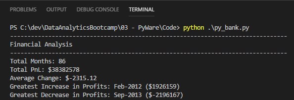
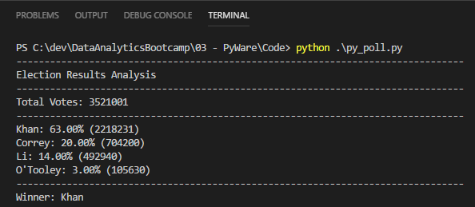

# PyWare

## What is this about?

### PyBank

In this assignment, I'm tasked with creating a Python script for analyzing the financial records of some company. I have a set of financial data called *budget_data.csv*. The dataset is composed of two columns: Date and Profit/Losses. The goal is to create a Python script that reads this data, calculates some specific statistics, prints this result to console and saves to the text file

### PyPoll

This time I have election data of a small town in a file called *election_data.csv* (Voter ID, County, Candidate) (if that would be the case in a real life I wouldn't be suprised that someone tried to interfere). I need to write a Python script to analyze this file and identify the winner. Thist information too should be printed to the console and saved to the text file.

## What is Inside

Note that my part is just to summarize and not sanitize the data (we assume that the data has already undergone this stage)

### PyBank

- The example file *budget_data.csv* with incoming data
  
- A Python script *py_bank.py* that does the job 

- The example output file *budge_data_financial_analysis.txt* that contains the financial analysis

- Also here is a screenshot of what this analysis looks like when printed to the console (VS Code terminal)

### PyPoll

- The example file *election_data.csv* with incoming data
  
- A Python script *py_poll.py* that does the job 

- The example output file *election_data_summary.txt* that contains the election statistics

- Also here is a screenshot of what this analysis looks like when printed to the console (VS Code terminal)

