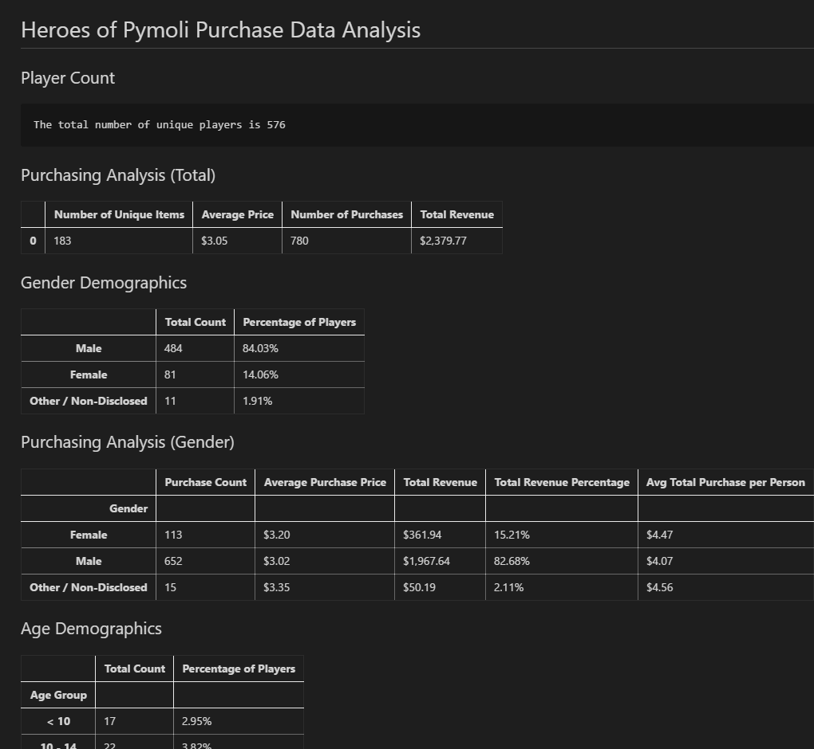

# The Kingdom of Pandas

## What is this about?

### Heroes of Pymoli

Imagine that I got a data analyst position in a gaming company that developed a fantasy free-to-play online game **Heroes of Pymoli**. My task here is to analyze in-game purchases data for this game trying to uncover some trends and get meaningful insights on how the company could increase its profits.

## What is Inside

### Heroes of Pymoli

- The example file [purchase_data.csv](Input/purchase_data.csv) with raw data
  
- A Jupyter Notebook [HeroesOfPymoli.ipynb](Code/HeroesOfPymoli.ipynb) that contains Python code, all the necessary data breakdowns and some trends uncovered

- A markdown file [HeroesOfPymoli.md](Output/HeroesOfPymoli.md) that contains just data breakdowns and analysis

- Also here is a screenshot of the part of the analysis

