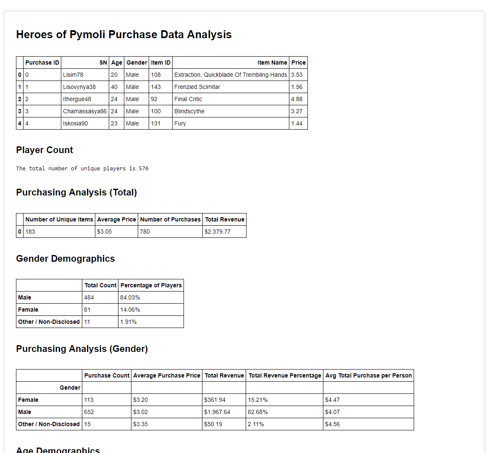
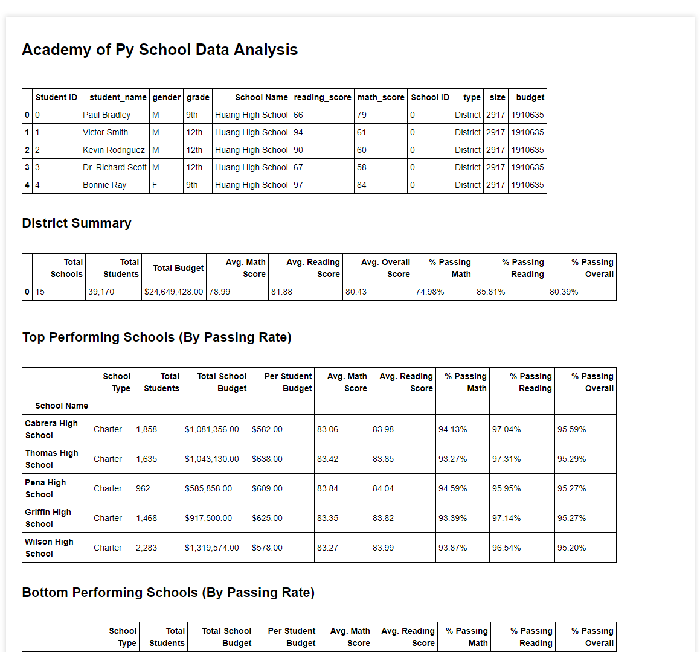

# The Realm of Pandas

## What is this about?

### Heroes of Pymoli

Imagine that I got a data analyst position in a gaming company that developed a fantasy free-to-play online game **Heroes of Pymoli**. My task here is to analyze in-game purchases data for this game trying to uncover some trends and get meaningful insights on how the company could increase its profits.

### Academy of Py

Now I assume that I'm volunteer for the education department and my goal is to analyze the district-wide standardized test results. I have access to every student's math and reading scores, as well as various information on the schools they attend. My goal is to aggregate the data to and showcase obvious trends in school performance.

## What is Inside

### Heroes of Pymoli

- The example file [purchase_data.csv](Input/purchase_data.csv) with raw data
  
- A Jupyter Notebook [HeroesOfPymoli.ipynb](Code/HeroesOfPymoli.ipynb) that contains Python code, all the necessary data breakdowns and some trends uncovered

- An HTML file [HeroesOfPymoli.html](Output/HeroesOfPymoli.html) that contains just data breakdowns and analysis

- Also here is a screenshot of the part of the analysis

### Academy of Py

- The example file [schools_complete.csv](Input/schools_complete.csv) with the list of schools

- The example file [students_complete.csv](Input/students_complete.csv) with the students score data
  
- A Jupyter Notebook [AcademyOfPy.ipynb](Code/AcademyOfPy.ipynb) that contains Python code, all the necessary data breakdowns and some trends uncovered

- An HTML file [AcademyOfPy.html](Output/AcademyOfPy.html) that contains just data breakdowns and analysis
  
- Also here is a screenshot of the part of the analysis

