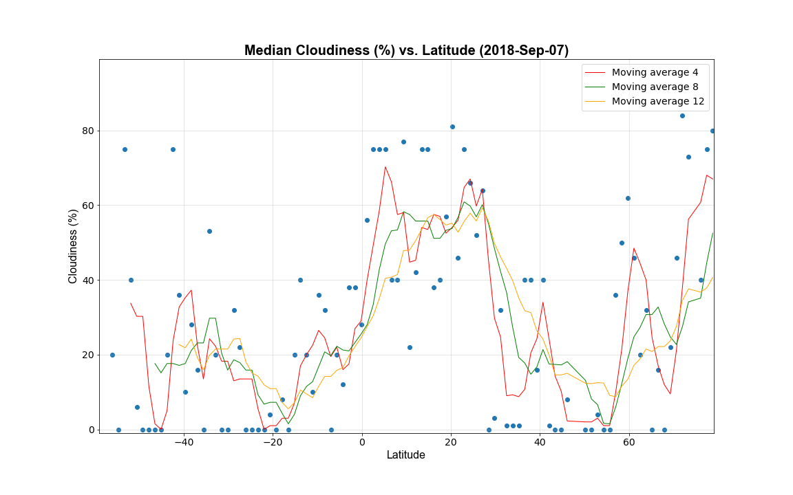

## Limitations

Bounded by the challenge limitations we have to use weather data available for the free account at `openweathermap.org`. Our account is limited to 60 API calls per minute. Generally, we have two types of data available:

- #### Current Weather at any specified city

    The disadvantage of this approach is that we'll end up comparing weather at different time zones thus the data will naturaly spread. Also if we just take one measurement per city we'll be noised by the temporary weather conditions. The advantage of this approach is that knowing their inner Id of the specific cities (more on where to get it later) we can bundle them in lists up to 25 cities so each bundle will be treated as one API calls.

- #### Forecast for any specified city

    Their forecast is done for next 5 days using 3 hour intervals.  The natural disadvantage is that this is not a real data but a prediction. The advantage is that we could take all these 40 data points (5 days * 24 hours / 3 hour inteval) and take the average value for each metric (reducing the noise generated by temporary conditions)

Ideally, we should perform this kind of research using historical average values for the same period of time expressed in specific time zone's local time but the historical weather is not available for the free account. For this challenge lets stick to the 'current weather' approach

## Building Cities List

Our goal here is to pick at least 500 cities for analysis, they should be evenly distributed across the whole range of latitudes. But since expressing a specific latitude weather by just one city is susceptible to errors lets follow the below algorithm:

1. Load all available cities from `openweathermap.org`
2. Sort them by latitude
3. Take the min an max available latitudes and calculate the available latitude range
4. Split this range into N (1<=N<=500, 1 <= X <= 20, N * X >= 500) subranges where N is number of data points we'd like to see on the charts and X is a number of cities we request weather for per one API call. For every latitude subrange pick X random cities that fall into it (up to X if the actual number of cities in this range is less). This way we'll easily analyze far more than 500 cities
5. For every city bundle perform an API cal for current weather and calculate the average metrics (a median will probably serve better than mean in that case)

This way we'll end up having up to N data points per city group which will be much more representative than the a single data point per city. Also these desired charts will look much cleaner and give higher probability of discovering meaningful trends.

This particular analysis will be done for the values **N=100** and **X=20** (up to 2000 cities). Keeping N lower allows us to reduce the chances that some latitude subranges won't include even a single city

    001: Retrieving weather for the following cities:
         Puerto Williams,CL
         South Georgia and the South Sandwich Islands,GS
         Barrio Almirante Brown,AR
         Ushuaia,AR
    002: Retrieving weather for the following cities:
         Grytviken,GS
         Río Grande,AR
         Provincia de Tierra del Fuego, Antártida e Islas del Atlántico Sur,AR
         Porvenir,CL
         Kaiken,AR
    003: Retrieving weather for the following cities:
         Región de Magallanes y de la Antártica Chilena,CL
         Punta Arenas,CL
         Chabunco,CL
         Río de los Ciervos,CL
    004: Retrieving weather for the following cities:
         Yacimiento Rio Turbio,AR
         Rio Gallegos,AR
         Hill Station,AR
         Puerto Natales,CL
         Veintiocho de Noviembre,AR
         Falkland Islands (Islas Malvinas),FK
         Rincon Grande Settlement,FK
         Mare Harbour Rancho,FK
         Stanley,FK
         Puerto Bories,CL
    005: Retrieving weather for the following cities:
         Archipel des Kerguelen,TF
         Comandante Luis Piedra Buena,AR
         Port-aux-Francais,TF
         El Calafate,AR
         San Julian,AR
         Puerto Santa Cruz,AR
    006: Retrieving weather for the following cities:
         Provincia de Santa Cruz,AR
         Gobernador Gregores,AR
    007: Retrieving weather for the following cities:
         Los Antiguos,AR
         Bluff,NZ
         Cochrane,CL
         Región Aisén del General Carlos Ibáñez del Campo,CL
         Cañadón Seco,AR
         Perito Moreno,AR
         Invercargill City,NZ
         Otara,NZ
         Las Heras,AR
         Puerto Deseado,AR
         Pico Truncado,AR
         Chile Chico,CL
    008: Retrieving weather for the following cities:
         Facundo,AR
         Clutha District,NZ
         Waverley,NZ
         Río Mayo,AR
         Valle,AR
         Otautau,NZ
         Caleta Olivia,AR
         Comodoro Rivadavia,AR
         Southland District,NZ
         Riversdale,NZ
         Wyndham,NZ
         Avenal,NZ
         Winton,NZ
         Las Pulgas,AR
         Momona,NZ
         Escalante,AR
         Sindicato Dodero,AR
         Balclutha,NZ
         Moeraki,NZ
         Ranfurly,NZ
    009: Retrieving weather for the following cities:
         La Junta,CL
         Rakaia,NZ
         Allenton,NZ
         Glenavy,NZ
         Camarones,AR
         Ashburton District,NZ
         Wanaka,NZ
         Little River,NZ
         Leeston,NZ
         Waitaki,NZ
         Omakau,NZ
         Waitangi,NZ
         Timaru District,NZ
         Pleasant Point,NZ
         Creighton,NZ
         Arrowtown,NZ
         Waimate District,NZ
         Jose de San Martin,AR
         Queenstown-Lakes District,NZ
         Twizel,NZ
    010: Retrieving weather for the following cities:
         Nugent,AU
         Woodbridge,AU
         Tasman,AU
         Derwent Valley,AU
         Bream Creek,AU
         Longley,AU
         Southern Midlands,AU
         Hobart,AU
         Lewisham,AU
         Cheviot,NZ
         Culverden,NZ
         Warrane,AU
         Kettering,AU
         Broadmarsh,AU
         Buckland,AU
         Rolleston,NZ
         Hokitika,NZ
         Halswell,NZ
         Lauderdale,AU
         Burwood,NZ
    011: Retrieving weather for the following cities:
         Railton,AU
         Interlaken,AU
         Chudleigh,AU
         Ancud,CL
         Natone,AU
         Los Pellines,CL
         Break O'Day,AU
         Riverlands,NZ
         Golconda,AU
         Calbuco,CL
         Wilmot,AU
         Cressy,AU
         Mapua,NZ
         Blessington,AU
         Goulds Country,AU
         Montana,AU
         Evandale,AU
         Pukerua Bay,NZ
         Lebrina,AU
         Lower Hutt,NZ
    012: Retrieving weather for the following cities:
         Filo-hua-hum,AR
         Horowhenua District,NZ
         Raumati Beach,NZ
         Paraparaumu North,NZ
         Ashhurst,NZ
         Flowerdale,AU
         Havelock North,NZ
         Hunterville,NZ
         Currie,AU
         General Conesa,AR
         Ratana,NZ
         Raumati South,NZ
         Paillaco,CL
         Villa La Angostura,AR
         Boat Harbour,AU
         Otane,NZ
         Palmerston North City,NZ
         Sanson,NZ
         Región de Los Ríos,CL
         Montagu,AU
    013: Retrieving weather for the following cities:
         Strzelecki,AU
         Woolamai,AU
         Port Welshpool,AU
         Gellibrand,AU
         Cudgee,AU
         Máfil,CL
         Departamento de Zapala,AR
         Cashmore,AU
         Taranaki,NZ
         Taradale,NZ
         Dennington,AU
         Inverloch,AU
         Lartigau,AR
         Pillanlelbun,CL
         Monte Hermoso,AR
         Hilario Ascasubi,AR
         Zapala,AR
         Bell Block,NZ
         Stoneyford,AU
         Curacautín,CL
    014: Retrieving weather for the following cities:
         Opaheke,NZ
         Bentleigh,AU
         Nilma North,AU
         Yarra Ranges,AU
         Olinda,AU
         Jacinto Arauz,AR
         Batán,AR
         Catani,AU
         Rotorua,NZ
         Coleraine,AU
         Villa Castelar,AR
         Lovely Banks,AU
         Dunkeld,AU
         Purén,CL
         Mulgrave,AU
         Clyde North,AU
         Cockatoo,AU
         Nambrok,AU
         Manukau City,NZ
         Drysdale,AU
    015: Retrieving weather for the following cities:
         Bethanga,AU
         Nimmitabel,AU
         Emu,AU
         Serpentine,AU
         Boxwood,AU
         Thalia,AU
         Violet Town,AU
         Eddington,AU
         Corowa,AU
         Ngunguru,NZ
         Yarriambiack,AU
         Lucyvale,AU
         Mooroopna North,AU
         Mooroopna,AU
         Beazleys Bridge,AU
         Natimuk,AU
         Undera,AU
         Frances,AU
         Yackandandah,AU
         Tumbarumba,AU
    016: Retrieving weather for the following cities:
         Bragado,AR
         Departamento de Maldonado,UY
         Murrumbidgee Shire,AU
         Taylors Flat,AU
         Weetangerra,AU
         Barmera,AU
         Lyrup,AU
         Colegiales,AR
         Partido de Rojas,AR
         Parryville,AU
         Loma Verde,AR
         Villa Reichembach,AR
         San Francisco Solano,AR
         Williamstown,AU
         Foxground,AU
         Gundaroo,AU
         Point Turton,AU
         Monte Castro,AR
         Lake Heights,AU
         Murrumburrah,AU
    017: Retrieving weather for the following cities:
         Juana Koslay,AR
         Laborde,AR
         Witchcliffe,AU
         Canowindra,AU
         Schofields,AU
         Mouille Point,ZA
         Zarate,AR
         San Luis,AR
         Oberon,AU
         La Rana,CL
         Terrigal,AU
         Departamento de Colonia,UY
         Fairfield,AU
         Quilicura,CL
         Peyrano,AR
         Undalya,AU
         Artarmon,AU
         Clontarf,AU
         Granville,AU
         Villa San José,AR
    018: Retrieving weather for the following cities:
         Toledo,AR
         La Ligua,CL
         Great Lakes,AU
         Fosterton,AU
         Bassendean,AU
         Trewilga,AU
         Gorge Rock,AU
         Sacanta,AR
         Tortugas,AR
         Wang Wauk,AU
         Villa Krause,AR
         Villa Dolores,AR
         Upper Swan,AU
         Parkerville,AU
         Bunnabunoo,AU
         Departamento de San Martín,AR
         Las Delicias,AR
         Piedras Coloradas,UY
         Wuuluman,AU
         Quebracho,UY
    019: Retrieving weather for the following cities:
         Horton,AU
         Argents Hill,AU
         Zastron,ZA
         Dungowan,AU
         Los Sauces,AR
         Bugaldie,AU
         Piallamore,AU
         Rio Ceballos,AR
         Hilario,AR
         Loomberah,AU
         Cosquin,AR
         Serrezuela,AR
         Yarrowitch,AU
         Merredin,AU
         El Pueblito,AR
         Goomalling,AU
         Coffs Harbour,AU
         Constitucion,UY
         Stoneville,AU
         Jeogla,AU
    020: Retrieving weather for the following cities:
         Tucabia,AU
         Triunfo,BR
         Capao da Canoa,BR
         Parobe,BR
         Bellair,ZA
         Santa Clara do Sul,BR
         Libertad,AR
         Muden,ZA
         Seelands,AU
         Taquara,BR
         State of South Australia,AU
         Nova Petropolis,BR
         The Village,ZA
         Pelham,ZA
         Charqueadas,BR
         Yarraford,AU
         Hebel,AU
         Mafeteng District,LS
         eSikhawini,ZA
         Winston Park,ZA
    021: Retrieving weather for the following cities:
         Florentino Ameghino,AR
         Churchill,AU
         Ernestina,BR
         Santa Lucía,AR
         Herlitzka,AR
         Eastern Heights,AU
         Tubarao,BR
         Northampton,AU
         Carianos,BR
         Kunghur,AU
         Beechmont,AU
         Kingsthorpe,AU
         Bom Jardim da Serra,BR
         Fordsdale,AU
         Leyburn,AU
         Millbong,AU
         Erval Seco,BR
         Sananduva,BR
         Bapaume,AU
         Meringandan,AU
    022: Retrieving weather for the following cities:
         Pirapo,PY
         Trichardt,ZA
         Kingdom of Swaziland,SZ
         Deagon,AU
         Mapleton,AU
         Kempton Park,ZA
         Eden Glen,ZA
         Puerto Piray,AR
         Nambour,AU
         Burpengary,AU
         Corupa,BR
         Pampa de los Guanacos,AR
         Blackbutt,AU
         West End,ZA
         Anchieta,BR
         D’Aguilar,AU
         Dulacca,AU
         Vaalpark,ZA
         Porto Uniao,BR
         Fram,PY
    023: Retrieving weather for the following cities:
         Mundubbera,AU
         Bronkhorstspruit,ZA
         Meekatharra,AU
         El Galpon,AR
         Laguna Naick-Neck,AR
         San Ramón,AR
         Taltal,CL
         Boschrand,ZA
         General Alvarado,AR
         Rosario de la Frontera,AR
         Iguape,BR
         Colonia Mauricio Jose Troche,PY
         Sao Mateus do Sul,BR
         Benfica,MZ
         Paranagua,BR
         Cerrillos,AR
         Cidade de Maputo,MZ
         Macia,MZ
         Tsiombe,MG
         Woodgate,AU
    024: Retrieving weather for the following cities:
         Las Palomas,PY
         Mokopane,ZA
         Jussara,BR
         Sítio João D. de Oliveira,BR
         Guararema,BR
         Rockhampton,AU
         Ingenio La Esperanza,AR
         Bororen,AU
         Ofcolaco,ZA
         Mochudi,BW
         Departamento de San Pedro,AR
         Embu,BR
         Maimara,AR
         Guapiara,BR
         Cajamar,BR
         Baralaba,AU
         La Mendieta,AR
         Phalaborwa,ZA
         Perico,AR
         Iandrinópolis,BR
    025: Retrieving weather for the following cities:
         Socorro,BR
         Cacapava,BR
         Canas,BR
         Chamnanga,ZW
         Naïa,NC
         Dourado,BR
         Karenga,NC
         Cervinho,BR
         Garca,BR
         Lencois Paulista,BR
         Manduri,BR
         Centenario do Sul,BR
         Itapui,BR
         Ocauçu,BR
         Ratholo,BW
         Natércia,BR
         Valinhos,BR
         Santa Maria da Serra,BR
         Sítio Santa Joana,BR
         Ibipora,BR
    026: Retrieving weather for the following cities:
         Leopoldina,BR
         Ipiguá,BR
         Fianarantsoa,MG
         Fuerte Olimpo,PY
         Tarija,BO
         Campestre,BR
         Bouloupari,NC
         Tonota,BW
         Matias Barbosa,BR
         Santo Expedito,BR
         Poindimie,NC
         Vista Alegre do Alto,BR
         Farino,NC
         Cajobi,BR
         Guidoval,BR
         Ikalamavony,MG
         Petit Bazar,RE
         Torrens Creek,AU
         Presidente Epitacio,BR
         Mirandopolis,BR
    027: Retrieving weather for the following cities:
         Kimiangatau Village,CK
         Yamparáez,BO
         Pica,CL
         Leandro Ferreira,BR
         Sao Joaquim da Barra,BR
         Bulawayo Province,ZW
         Joao Monlevade,BR
         Strathdickie,AU
         Vargem Alegre,BR
         Saint Hubert,MU
         Divinopolis,BR
         Ambositra,MG
         Estrela dOeste,BR
         Prata,BR
         Gros Cailloux,MU
         La Flora,MU
         L’Escalier,MU
         Luz,BR
         Lajinha,BR
         Cap Malheureux,MU
    028: Retrieving weather for the following cities:
         Headlands,ZW
         Moramanga,MG
         Huayllas,BO
         Canápolis,BR
         Georgetown,AU
         Tomina,BO
         Vava`u,TO
         Pedrinópolis,BR
         Rusape,ZW
         Nova Vicosa,BR
         Guanhaes,BR
         Alofi,NU
         Epworth,ZW
         Sobrália,BR
         Corumbaíba,BR
         Manjakandriana,MG
         Presto,BO
         Halls Creek,AU
         Cassowary Coast,AU
         Midlands Province,ZW
    029: Retrieving weather for the following cities:
         Montes Claros,BR
         Aragoiânia,BR
         Cocachacra,PE
         Choma,ZM
         Parauna,BR
         Hockley,AU
         Ohangwena,NA
         Punta de Bombon,PE
         Mashonaland West Province,ZW
         Aricanduva,BR
         Namaka,FJ
         Topaz,AU
         Escondido,BR
         Itanhem,BR
         Afaahiti,PF
         Amorinópolis,BR
         Colomi,BO
         Comunidad La Mayca,BO
         Leme do Prado,BR
         Fenoarivo Atsinanana,MG
    030: Retrieving weather for the following cities:
         Planaltina,BR
         Luíee,MZ
         Bloomfield,AU
         Guiratinga,BR
         Mapiri,BO
         Wonga,AU
         Huatajata,BO
         Zomba District,MW
         Ascension, and Tristan da Cunha Saint Helena,SH
         Distrito Federal,BR
         Araguaiana,BR
         Drivaï,VU
         Pau Brasil,BR
         Borroloola,AU
         Chikwawa,MW
         Vizcachane,PE
         Abadiania,BR
         Navonda,VU
         Namibe Province,AO
         Lontra,BR
    031: Retrieving weather for the following cities:
         Nunoa,PE
         Vallejos,BO
         Western District,AS
         Pontal de São João da Barra,BR
         Chadiza,ZM
         Faleasao,AS
         Leone,AS
         Leulumoega,WS
         Antsohihy,MG
         Palmas de Monte Alto,BR
         Apolo,BO
         Chignayhua,PE
         Tanhacu,BR
         Tinta,PE
         Coracora,PE
         Nova Olimpia,BR
         Antalaha,MG
         Sigavé,WF
         Afenga,WS
         Kalabo,ZM
    032: Retrieving weather for the following cities:
         Província de Cabo Delgado,MZ
         Paramirim,BR
         Calca,PE
         Huanta,PE
         Salvador,BR
         Pé do Morro,BR
         Darwin,AU
         Torba Province,VU
         Nazare,BR
         Chincha Alta,PE
         Passé,BR
         Cook,AU
         Anta,PE
         Paratinga,BR
         Macaubas,BR
         Muniz Ferreira,BR
         Tanquinho,BR
         Docota,AO
         Alvorada,BR
         Mulaya,ZM
    033: Retrieving weather for the following cities:
         Liuli,TZ
         Katoto,MW
         Feira de Santana,BR
         Betahitra,MG
         Cardeal da Silva,BR
         Barra,BR
         Djoyezi,KM
         Chironkamba,KM
         Bellavista,PE
         Huancayo,PE
         Surquillo,PE
         San Bartolo,PE
         Sicaya,PE
         Barranco,PE
         Mundo Novo,BR
         Mramani,KM
         Inhambupe,BR
         Seabra,BR
         Jauja,PE
         Ibipeba,BR
    034: Retrieving weather for the following cities:
         Barakabita,ID
         Mahanje,TZ
         Alta Floresta,BR
         Muribeca,BR
         Nggongi,ID
         Lumpundu,CD
         Quilipe,PE
         Estado de Tocantins,BR
         Walakeri,ID
         Marechal Deodoro,BR
         Wengaingo,ID
         Taquari,BR
         Porto Amboim,AO
         Taulaga,AS
         Limoeiro de Anadia,BR
         Tucano,BR
         Umanggudang,ID
         Thornton,ZM
         Chaupimarca,PE
         Rumphi District,MW
    035: Retrieving weather for the following cities:
         Zepe,ID
         Mauponggo,ID
         Banjar Parekan,ID
         Pagutan,ID
         Vwawa,TZ
         Waepau,ID
         Waworada,ID
         Majan,ID
         Tuvalu,TV
         Purwoharjo,ID
         Kambu,ID
         Lantebaru,ID
         Dasangeria Selatan,ID
         Wanagiri,ID
         Semalang,ID
         Sere,ID
         Mangulewa,ID
         Angkahgede,ID
         Huaraz,PE
         Tamanbumigora,ID
    036: Retrieving weather for the following cities:
         Gambiran Wetan,ID
         Nganjuk,ID
         Tugu,ID
         Jatiwangi,ID
         Rancapeundey,ID
         Tegallame,ID
         Rancah,ID
         Cimanglid,ID
         Becirto,ID
         Conde,BR
         Garahan,ID
         Sukorambi,ID
         Ascension,SH
         Mandalasari,ID
         Pajaran,ID
         Kedungpeluk,ID
         Sumuran,ID
         Krajan Gebangan,ID
         Cipari,ID
         Gambuhan Kidul,ID
    037: Retrieving weather for the following cities:
         Ngimbang,ID
         Margahayu,ID
         Regeneracao,BR
         Palemgede,ID
         Pasatan,ID
         Sambongrejo,ID
         Cikuning,ID
         Kaliori,ID
         Sambong,ID
         Pondokwaru,ID
         Jakarta,ID
         Pio IX,BR
         Gemulung,ID
         Citalahab,ID
         Lae,PG
         Bapoh,ID
         Nagreg,ID
         Tajur,ID
         Manungtung,ID
         Karangtengah,ID
    038: Retrieving weather for the following cities:
         Provinsi Lampung,ID
         Itaiçaba,BR
         Provinsi Sulawesi Selatan,ID
         Kimbe,PG
         Lagunas,PE
         Timon,BR
         Sechura,PE
         Kotabumi,ID
         Caninde,BR
         Touros,BR
         Palattae,ID
         Victoria,SC
         Kigunga,TZ
         Povo Grande,AO
         Jaguaruana,BR
         Ville de Kinshasa,CD
         Ipanguacu,BR
         Aracoiaba,BR
         Nova Russas,BR
         Panjang,ID
    039: Retrieving weather for the following cities:
         Puerto Narino,CO
         Région de la Lékoumou,CG
         Igurubi,TZ
         iProvense ya Gitega,BI
         Kwa Jomvu,KE
         Cempa Pasar,ID
         Nkoaranga,TZ
         iProvense ya Karuzi,BI
         Getengan,ID
         Langnga,ID
         Mombasa,KE
         Mbulu,TZ
         iProvense ya Bururi,BI
         Old Shinyanga,TZ
         Babati,TZ
         Totumbang,ID
         Malunda,ID
         Mwembe,TZ
         Nzega,TZ
         Tangratte,ID
    040: Retrieving weather for the following cities:
         Provinsi Kalimantan Selatan,ID
         Cururupu,BR
         Nyamuswa,TZ
         Capitao Poco,BR
         Prainha,BR
         Mwanza,TZ
         Republic of Ecuador,EC
         Curuai,BR
         Urucara,BR
         Provincia del Cañar,EC
         Wonorejo,ID
         Tome Acu,BR
         Alenquer,BR
         Muhato,RW
         Provincia de Bolívar,EC
         Cameta,BR
         iProvense ya Kirundo,BI
         Rulenge,TZ
         Cuchucún,EC
         Moju,BR
    041: Retrieving weather for the following cities:
         Kanungu,UG
         Okondja,GA
         Provincia de Cotopaxi,EC
         Nazaré,BR
         Ventanas,EC
         Boluka,CD
         Nairobi South,KE
         Rambatan,ID
         San Isidro,EC
         Sawahlunto,ID
         Gahondogo,RW
         Belem,BR
         Republic of the Congo,CG
         Katerero,TZ
         Beru,KI
         Mbarara,UG
         Provincia de Los Ríos,EC
         Salimpaung,ID
         Provincia de Napo,EC
         Sungaisarik,ID
    042: Retrieving weather for the following cities:
         Buwenge,UG
         Merus,ID
         Western Province,KE
         Ntoroko,UG
         Wakiso District,UG
         Balabala,UG
         Kabarole District,UG
         Pontianak,ID
         Contadero,CO
         Luwero District,UG
         Batikayafi,CD
         Busia District,UG
         Pimpi,ID
         Ricaurte,CO
         Guaitarilla,CO
         Rambara,KE
         Province de l’ Ogooué-Ivindo,GA
         Bugis,ID
         São Tomé,ST
         Wobulenzi,UG
    043: Retrieving weather for the following cities:
         La Tola,CO
         La Plata,CO
         Kelapa Sawit,MY
         Basankusu,CD
         Bikenibeu Village,KI
         Saacow,SO
         El Tambo,CO
         Olaya Herrera,CO
         Ouesso,CG
         Koka,ID
         El Tambo,CO
         Soroti,UG
         Bitica,GQ
         Nadiket,UG
         Suaza,CO
         Cumbitara,CO
         Palingi,UG
         Marka,SO
         Tabwakea Village,KI
         Taman Khalidi Baru,MY
    044: Retrieving weather for the following cities:
         Banting,MY
         Villavieja,CO
         Panguruan,ID
         Timbiqui,CO
         Republic of Maldives,MV
         Planadas,CO
         Garbahaarrey,SO
         Makin Village,KI
         Taman Labu Jaya,MY
         Yaounde,CM
         Mentekab,MY
         Kampong Baharu Balakong,MY
         Tarakan,ID
         Kitgum District,UG
         Dolores,CO
         Labuhan Deli,ID
         Lolodorf,CM
         Telok Baharu,MY
         Crucero de Pescador,CO
         Nkan,CM
    045: Retrieving weather for the following cities:
         Mega,ET
         Maridi,SS
         Gachancipa,CO
         Bandar Seri Begawan,BN
         Stoelmanseiland,SR
         Palocabildo,CO
         Tonga,CM
         Vodiéko,CI
         Pereira,CO
         Guamo,CO
         El Diamante,CO
         Murillo,CO
         El Aserradero,VE
         Carnot,CF
         Villahermosa,CO
         Sumua-parú-mata,VE
         Harper,LR
         Potaro-Siparuni Region,GY
         Calabar,NG
         Imogwu-Agwa,NG
    046: Retrieving weather for the following cities:
         Godo,ET
         El Espino,CO
         Quipama,CO
         Quinchia,CO
         Kagay,PH
         Adamaoua Region,CM
         Socorro,CO
         Marienburg,SR
         Babanki,CM
         Republic of Liberia,LR
         Soubre,CI
         San Isidro,VE
         San Pedro,CO
         Lun Pequeno,PH
         Salgar,CO
         Awka,NG
         Kilómetro Ochenta y Ocho,VE
         Liberty,PH
         Ambalangoda,LK
         Guiberoua,CI
    047: Retrieving weather for the following cities:
         Manang,TH
         Palmira,VE
         Igbo Ora,NG
         Tongole,SL
         Apomu,NG
         Gaalkacyo,SO
         Autonomous Region in Muslim Mindanao,PH
         Yan Ta Khao,TH
         Wichit,TH
         Ex-Colonia Móvil del Dorado,VE
         Dipolo,PH
         Cuambog,PH
         Lumbayan,PH
         Caucasia,CO
         Ratsada,TH
         Kenema,SL
         Malaga,CO
         Rancho de Tejas,VE
         San Rafael del Pinal,VE
         Nabunturan,PH
    048: Retrieving weather for the following cities:
         Genet,ET
         Ciudad Bolivar,VE
         Kauswagan,PH
         Thai Mueang,TH
         Bang Khan,TH
         Tỉnh Bạc Liêu,VN
         Guamal,CO
         San Miguel,PH
         Kuzhithurai,IN
         Bella Vista,PA
         Mayo Belwa,NG
         Wenji,ET
         El Pantano,VE
         Lingion,PH
         Botijones,VE
         Chian Yai,TH
         Yengema,SL
         Provincia de Bocas del Toro,PA
         Surandai,IN
         Kuna Yala,PA
    049: Retrieving weather for the following cities:
         Vom,NG
         Kachia,NG
         Turmero,VE
         Manalad,PH
         Heipang,NG
         Municipio José Tadeo Monagas,VE
         Araure,VE
         Hipasngo,PH
         Upper Nile State,SS
         Barrio Hispano,CR
         El Sombrero,VE
         Toluviejo,CO
         Bodinayakkanur,IN
         Himamaylan,PH
         Piparo,TT
         Tortuga,TT
         Fais Municipality,FM
         Municipio Tinaco,VE
         Rach Gia,VN
         Miraflores,VE
    050: Retrieving weather for the following cities:
         Punto Fijo,VE
         Aganan,PH
         Pili,PH
         Culaba,PH
         Ogtongon,PH
         Mettuppalaiyam,IN
         Balasan,PH
         Province of Aklan,PH
         Ormoc City,PH
         Culasi,PH
         Namakkal,IN
         Province of Iloilo,PH
         Placer,PH
         Dapdap,PH
         Manoc-Manoc,PH
         Kattuputtur,IN
         Tindog,PH
         Préfecture de Télimélé,GN
         Caluya,PH
         Jarigue,PH
    051: Retrieving weather for the following cities:
         Demba Kunda,GM
         Gabao,PH
         El Ayote,NI
         Matiguas,NI
         Province of Masbate,PH
         Amapala,HN
         Kodlipet,IN
         La Jicaral,NI
         Tiptur,IN
         Saint Andrew,GD
         Catubig,PH
         Iriga City,PH
         Evangelista,PH
         Jikamshi,NG
         Province du Sanguié,BF
         Allen,PH
         Ramapuram,IN
         Sattahip,TH
         Brikama,GM
         Nouna,BF
    052: Retrieving weather for the following cities:
         Malabag,PH
         Salvacion,PH
         Région de Dakar,SN
         Kaliliog,PH
         Palestina,PH
         Nguigmi,NE
         Taizz,YE
         Bhatkal,IN
         Lucerna,HN
         Atiquizaya,SV
         Labo,PH
         Région du Lac,TD
         Joal-Fadiout,SN
         Nong Don,TH
         Villa de San Francisco,HN
         San Jose del Golfo,GT
         Pila,PH
         San Jose,PH
         Chapeltique,SV
         Frontera Hidalgo,MX
    053: Retrieving weather for the following cities:
         San Jeronimo,HN
         Sacapulas,GT
         Bonito Oriental,HN
         Lat Yao,TH
         Santa Lucia La Reforma,GT
         Tarlac,PH
         Pang Sila Thong,TH
         Lobong,PH
         Santa Rita,HN
         Urbiztondo,PH
         Arenal,HN
         Ban Khangkeung,LA
         El Balsamo,HN
         Tejutla,GT
         Baracoa,HN
         Pueblo Nuevo,HN
         Tarim,YE
         Nancamarinan,PH
         Capulaan,PH
         Tan Sum,TH
    054: Retrieving weather for the following cities:
         Cervantes,PH
         Sint Eustatius,BQ
         Huai Phueng,TH
         Santa Lucia,PH
         Khok Si Suphan,TH
         Palomares,MX
         Soldier Ghaut,MS
         Mudhol,IN
         Lagawe,PH
         Guanaja,HN
         Mirialguda,IN
         Municipality of Alicia,PH
         Al Khirab,YE
         Changwat Khon Kaen,TH
         Belize City,BZ
         Paldit,PH
         Gerald's,MS
         Soyatitán,MX
         Konnur,IN
         Socialist Republic of Vietnam,VN
    055: Retrieving weather for the following cities:
         Long,TH
         Tianya,CN
         Municipio de Juncos,PR
         Xochitepec,MX
         Villa Jaragua,DO
         Coqui,PR
         Longguang,CN
         Mali and Munjeri,IN
         Currimao,PH
         Parish of Saint Elizabeth,JM
         Phon Phisai,TH
         Cutzamala de Pinzon,MX
         Dharur,IN
         Toa Alta,PR
         Basavakalyan,IN
         Ixcateopan de Cuauhtémoc,MX
         Ban Wat Pa,TH
         Ban Doen,TH
         El Coacoyul,MX
         Siddipet,IN
    056: Retrieving weather for the following cities:
         Totolapan,MX
         Manor,IN
         Purushottampur,IN
         Myoma,MM
         Coatepec Harinas,MX
         Udaigiri,IN
         Coatepec,MX
         Santiago Teyahualco,MX
         Basmat,IN
         Puopelu,US
         Terrenate,MX
         Magdalena Mixhuca,MX
         Tonila,MX
         San Pedro Cholula,MX
         Acambay,MX
         Tomatlan,MX
         Mexico City,MX
         Temamatla,MX
         Sabaneta,DO
         Los Reyes,MX
    057: Retrieving weather for the following cities:
         San Miguel de Cozumel,MX
         Amascala,MX
         Jalalpur,IN
         Rio Guayabal de Yateras,CU
         Chandvad,IN
         Kanasin,MX
         Union Territory of Damān and Diu,IN
         Las Lomas,MX
         Huazalingo,MX
         Angul,IN
         Sindi,IN
         Dharangaon,IN
         Gibara,CU
         Sambalpur,IN
         Phulabani,IN
         Deoli,IN
         Alfajayuca,MX
         Meiktila,MM
         Matthew Town,BS
         Vistahermosa de Negrete,MX
    058: Retrieving weather for the following cities:
         Punasa,IN
         Lawai,US
         Kalikapur,IN
         Zhongshan,CN
         Guanajay,CU
         Kuiyong,CN
         Cumanayagua,CU
         Ekyigon,MM
         Arista,MX
         Huangjiang,CN
         Zhongdacuo,TW
         Balarampur,IN
         Calimete,CU
         Ciudad Mante,MX
         Shiqiao,CN
         Kamarhati,IN
         Sonari Town,IN
         El Higo,MX
         Primero de Enero,CU
         Dhandhuka,IN
    059: Retrieving weather for the following cities:
         Balarampur,IN
         Alot,IN
         Agar,IN
         Basoda,IN
         Ranir Bazar,IN
         Ad Dilam,SA
         Xiancheng,CN
         Zhongshanzhuang,TW
         Sarubera,IN
         Hazaribag,IN
         Mugma,IN
         Thenzawl,IN
         Xintang,CN
         Wenlan,CN
         Kadi,IN
         Mengmeng,CN
         Bhuj,IN
         Sarangpur,IN
         Durango,MX
         Jiulong,CN
    060: Retrieving weather for the following cities:
         Dongchuan,CN
         Ormara,PK
         Fucha,CN
         Colonia Valle,MX
         Takipur,BD
         Chiguang,CN
         Andros Town,BS
         Baran,IN
         Raghunathpur,IN
         Shinas,OM
         Aizi,CN
         Koelwar,IN
         Naraini,IN
         Cabos,MX
         Shaxiaba,CN
         Badiraguato,MX
         Madhogarh,IN
         Compuertas,MX
         Qidian,CN
         Dhulian,IN
    061: Retrieving weather for the following cities:
         Merta,IN
         Taoling,CN
         Rancho La Pachona,MX
         Bihariganj,IN
         North Port,US
         Miami,US
         Laureles,US
         San Francisco del Oro,MX
         Miami Gardens,US
         Naples Manor,US
         Three Oaks,US
         Sita Road,PK
         Betty Acres Colonia,US
         Samastipur,IN
         Shaxi,CN
         Gauripur,IN
         Unnao,IN
         Scissors,US
         Rangpur Division,BD
         Guanqian,CN
    062: Retrieving weather for the following cities:
         Garachico,ES
         Yanmen,CN
         Del Mar,US
         (Pokharithok Bajar),NP
         Dongping,CN
         Huangxi,CN
         Haines City,US
         Luzhou,CN
         Shishan,CN
         Gezan,CN
         Hetan,CN
         Tor,EG
         Zunyi,CN
         Bhadasar,IN
         Trinity,US
         Yezhi,CN
         Binjiang,CN
         Treasure Island,US
         Helumbu,NP
         Ouli,CN
    063: Retrieving weather for the following cities:
         Foshan,CN
         Chiefland,US
         Kotdwara,IN
         Jiang’aokou,CN
         Al Jaghbub,LY
         Ziyang,CN
         Tosca de Ana María,ES
         Bailu,CN
         Yaojia,CN
         Bellaire,US
         Haozigang,CN
         Tianhong,CN
         Wangjiaping,CN
         Zhonghekou,CN
         Huangcun,CN
         Kongkeshu,CN
         Gaotang,CN
         El Paso,ES
         Meiling,CN
         Kālkāji Devi,IN
    064: Retrieving weather for the following cities:
         Xitianmu,CN
         Diamondhead,US
         Muḩāfaz̧at al Qalyūbīyah,EG
         Sanlifan,CN
         Muḩāfaz̧at Shamāl Sīnā’,EG
         Sansheng,CN
         Merrydale,US
         Zongluzui,CN
         Longquan,CN
         Jishan,CN
         Al Alamayn,EG
         Zhifang,CN
         Xinwan,CN
         Sirhind,IN
         Fusilier Mobile Home Estates,US
         Wakulla County,US
         Anchang,CN
         Luxiang,CN
         Zhangwu,CN
         Ray City,US
    065: Retrieving weather for the following cities:
         Pagnag,CN
         Dasua,IN
         Dongyu,CN
         Mudu,CN
         Fuwah,EG
         Sheikhupura,PK
         Nanyang,CN
         Rafah,PS
         Qingyu,CN
         Jiangduo,CN
         Jonesboro,US
         Xinqiao,CN
         Talmest,MA
         Robinson,US
         Bhakkar,PK
         Harry Manzo,MX
         Puji,CN
         Even Yehuda,IL
         Wilāyat-e Zābul,AF
         Budrus,PS
    066: Retrieving weather for the following cities:
         Paosha,CN
         San Jacinto,US
         Shelby,US
         Henry County,US
         Jaurian,IN
         At Taybah,PS
         Byron,US
         Grayson Valley,US
         Punch,IN
         Grenada,US
         Wangying,CN
         Shuizhai,CN
         Maljamar,US
         Big Sandy,US
         Malou,CN
         Sikeshu,CN
         Rolling Hills Estates,US
         Dorcheh Piaz,IR
         Miyada,JP
         Hasbaiya,LB
    067: Retrieving weather for the following cities:
         Lilburn,US
         Aragon,US
         Lake Havasu City,US
         Middleberg,US
         Peshawar,PK
         Hamanose,JP
         Xinglong,CN
         Xiaoqiu,CN
         Pingyao,CN
         Liuqu,CN
         Gengzhen,CN
         Marion County,US
         Ergates,CY
         Ḩeşār-e Sefīd,IR
         Taijing,CN
         Bianzhuang,CN
         Yima,CN
         Tiztoutine,MA
         Homeland Park,US
         Dajing,CN
    068: Retrieving weather for the following cities:
         Shiraoka,JP
         Longxing,CN
         Jenzan,KR
         Swanquarter,US
         Washita County,US
         Parūkh,AF
         Gassville,US
         Dover,US
         Santa Venera,MT
         Kunsan,KR
         Northlakes,US
         Grand Canyon Village,US
         Kaminokawa,JP
         White County,US
         Namekawa,JP
         Qarah Gawl al ‘Ulyā,IQ
         Kassab,SY
         Kenly,US
         Marbella,ES
         Jeonju,KR
    069: Retrieving weather for the following cities:
         Bluewell,US
         Trigueros,ES
         Berrocal,ES
         Roghudi,IT
         Soportújar,ES
         Capileira,ES
         Willard,US
         Loulé (São Sebastião),PT
         Bismarck,US
         Niğde,TR
         Purullena,ES
         Gilena,ES
         Pleasanton,US
         Wichita,US
         Torremolinos,ES
         Almocita,ES
         Kerh,TR
         Periana,ES
         Cammarata,IT
         Isle of Wight,US
    070: Retrieving weather for the following cities:
         Carcer,ES
         Edgerton,US
         Baterno,ES
         Lone Jack,US
         Garrovilla (La),ES
         Benimuslem,ES
         Fortuna,ES
         Morris Mobile Home Park,US
         Eldon,US
         Howard County,US
         Sanet y Negrals,ES
         Ellsworth County,US
         Painho,PT
         San Isidro,ES
         Basilicò,IT
         Belle Haven,US
         Fregenal de la Sierra,ES
         Avanos,TR
         Argalasti,GR
         Lydia,US
    071: Retrieving weather for the following cities:
         Vilafranca de Bonany,ES
         Jabaloyas,ES
         Qala,AZ
         Osborne,US
         Pitman,US
         Shelbyville,US
         San Clemente,ES
         Sot de Chera,ES
         Monreal del Llano,ES
         San Bartolome de las Abiertas,ES
         Ilic,TR
         Cherry Hill Mall,US
         Charneca,PT
         Luso,PT
         Torres de Albarracin,ES
         Reguengo do Fetal,PT
         Ankara,TR
         Skyline View,US
         Provincia di Potenza,IT
         Plumas County,US
    072: Retrieving weather for the following cities:
         Aguilón,ES
         Bridgeport,US
         Miño de San Esteban,ES
         Castellví de Rosanes,ES
         Summit,US
         Madison,US
         Ribeiros,PT
         Capari,MK
         Golkoy,TR
         Bornes de Aguiar,PT
         Robbins,US
         San Mango Piemonte,IT
         Boiano,IT
         Cambra,PT
         Paços,PT
         Lock Port,US
         Kurbnesh,AL
         Motta Montecorvino,IT
         Villaseca de Arciel,ES
         Durham,US
    073: Retrieving weather for the following cities:
         Melgar de Arriba,ES
         Salvaterra de Miño,ES
         Melon,ES
         Saint-Hippolyte,FR
         Carson City,US
         Donja Seoca,ME
         Neves (As),ES
         Santibanez de la Pena,ES
         Whitman,US
         Murchante,ES
         Boone County,US
         Lombia,FR
         Janjina,HR
         SantEusanio Forconese,IT
         South Corning,US
         Berango,ES
         Golmar,ES
         Estialescq,FR
         San Vicente del Valle,ES
         Bercianos del Real Camino,ES
    074: Retrieving weather for the following cities:
         Veynes,FR
         Smederevska Palanka,RS
         Denmark,US
         El Astillero,ES
         Kiel,US
         Galapian,FR
         Gillette,US
         Serra Riccò,IT
         Pietralunga,IT
         Carpasio,IT
         Bardos,FR
         Varvarin,RS
         Mill Village,CA
         Zaton,HR
         Saint-Sernin,FR
         Marina de Cudeyo,ES
         Islamey,RU
         Bresno Polje,RS
         Marcillac-Vallon,FR
         Montélimar,FR
    075: Retrieving weather for the following cities:
         Neuvic-Entier,FR
         Schitu-Ostrov,RO
         Karanac,HR
         Sauvagnat-Sainte-Marthe,FR
         Genissieux,FR
         Saint-Sorlin-en-Bugey,FR
         Département de la Loire,FR
         Harvey,CA
         Dervio,IT
         Saint-Julien-de-Coppel,FR
         Torrazzo,IT
         Bata,RO
         Parcoul,FR
         Vipava,SI
         Changan,CN
         Old Chelsea,CA
         Vic-sur-Cère,FR
         Broni,IT
         Due Carrare,IT
         San Giorgio di Lomellina,IT
    076: Retrieving weather for the following cities:
         Seeboden,AT
         Saillon,CH
         Satteins,AT
         Gossendorf,AT
         Egolzwil,CH
         Kethely,HU
         Sappada,IT
         Subingen,CH
         Montfand,FR
         Kerekegyhaza,HU
         Wald (ZH),CH
         Lezay,FR
         Mauves-sur-Loire,FR
         Hertenstein,CH
         Feldbach,AT
         Beruges,FR
         Glavanesti,RO
         Cardigan,CA
         Mont-sur-Rolle,CH
         Saint-Aubin-le-Cloud,FR
    077: Retrieving weather for the following cities:
         Goulet,FR
         Neu-Lindach,DE
         Cernay,FR
         Landkreis Konstanz,DE
         Obersimbach,DE
         Horgau,DE
         Täfertingen,DE
         Auguaise,FR
         Corbreuse,FR
         Schwaighausen,DE
         Ohmden,DE
         Heuweiler,DE
         Immendingen,DE
         Weidenstetten,DE
         Redleiten,AT
         Coulmer,FR
         Oberweidach,DE
         Weil im Schonbuch,DE
         Sedlice,CZ
         Toss,CH
         ERROR!Internal error: 500001
    078: Retrieving weather for the following cities:
         Bonnigheim,DE
         Budisov,CZ
         Martinsheim,DE
         Kammerstein,DE
         Gouvernes,FR
         Proussy,FR
         Canteleu,FR
         Falkenstein,DE
         Oberpleichfeld,DE
         Perscheid,DE
         Altenkirchen,DE
         Waldleiningen,DE
         Altanbulag,MN
         Longraye,FR
         Kastl,DE
         Arnbruck,DE
         Lieury,FR
         Ober Kostenz,DE
         Gebroth,DE
         Couilly-Pont-aux-Dames,FR
         ERROR!Internal error: 500001
    079: Retrieving weather for the following cities:
         Olsen,DE
         Vitry-en-Artois,FR
         Loon Lake,CA
         Sollstedt,DE
         Untermaßfeld,DE
         Legnica,PL
         Norrent-Fontes,FR
         Tournehem-sur-la-Hem,FR
         Brandroster,DE
         Hirtscheid,DE
         Flobecq,BE
         Horhausen,DE
         Bad Hersfeld,DE
         Stanwell,GB
         Köllme,DE
         Remagen,DE
         Heide,DE
         Oberbiel,DE
         Outreau,FR
         Schildau,DE
    080: Retrieving weather for the following cities:
         Dlutow,PL
         Offen,DE
         Llangelynin,GB
         London Borough of Harrow,GB
         Inkberrow,GB
         Newport,GB
         Kalme,DE
         Chetvërtyy Posëlok,RU
         Gröbern,DE
         Wivenhoe,GB
         Behnsdorf,DE
         Jeggau,DE
         Negenborn,DE
         Milejczyce,PL
         Halle,DE
         Vehrte,DE
         Voorhof,NL
         Almelo,NL
         Esebeck,DE
         Gemeente Weesp,NL
    081: Retrieving weather for the following cities:
         Hausbruch,DE
         Christinenthal,DE
         Bridlington,GB
         Ukhtuy,RU
         Cheremkhovo,RU
         Trittau,DE
         Looma,CA
         Neubrandenburg,DE
         Abzakovo,RU
         Goldenbow,DE
         Fedorovka,KZ
         Burnley,GB
         Lehmke,DE
         Woodsetts,GB
         Wilhelmsburg,DE
         Timmerhorn,DE
         Kroppelshagen-Fahrendorf,DE
         Droylsden,GB
         Sukhaya Orlitsa,RU
         Brest,DE
    082: Retrieving weather for the following cities:
         Preetz,DE
         Bol’shoy Sanchur,RU
         Krempel,DE
         Fakse,DK
         Witzwort,DE
         Satis,RU
         Portavogie,GB
         Kulautuva,LT
         Yasennaya,RU
         Arkhangel’skoye,RU
         Langenhorn,DE
         Zabor’ye,RU
         Pryamoglyadovo,RU
         Voynyukovo,RU
         Dmitrovka,RU
         Husum,DE
         Glusing,DE
         Novoye Titovo,RU
         Pyzhëvo,RU
         Juhlschau,DE
    083: Retrieving weather for the following cities:
         Kinross,GB
         Butka,RU
         Loknya,RU
         Zapadnoye Degunino,RU
         Severka,RU
         Mikhaylovskoye,RU
         Borisovskoye,RU
         Ufimskiy,RU
         Pokrovskoye-Streshnëvo,RU
         Medvedkovo,RU
         Bogandinskiy,RU
         East Wemyss,GB
         Savostino,RU
         Uval’yevo,RU
         Kudykino,RU
         Potochino,RU
         Novochernorechenskiy,RU
         Nechaikha,RU
         Kameshkovo,RU
         Nizhniy Novgorod,RU
    084: Retrieving weather for the following cities:
         Inčukalna Novads,LV
         Opalikhino,RU
         Balmedie,GB
         Vetlanda,SE
         Dornoch,GB
         Reftele,SE
         Storvorde,DK
         Poddorye,RU
         Ural’skiy,RU
         Mölndals Kommun,SE
         Thane,US
         Ronnang,SE
         Novopanovo,RU
         Fat’yanovo,RU
         Varberg,SE
         Khlyabishino,RU
         Ayat’,RU
         Shukhovo,RU
         Bolshoye Selo,RU
         Monetnyy,RU
    085: Retrieving weather for the following cities:
         Mezhdurechenskiy,RU
         Johvi,EE
         Fredrikstad,NO
         Hjelmelandsvagen,NO
         Käpplunda,SE
         Berezniki,RU
         Kehtna,EE
         Järvakandi vald,EE
         Tonstad,NO
         Mariefred,SE
         Loo,EE
         Brastad,SE
         Parabel,RU
         Mortnas,SE
         Vagnharad,SE
         Pärnumaa,EE
         Clarks Point,US
         Skattkarr,SE
         Kumla,SE
         Chistyye Bory,RU
    086: Retrieving weather for the following cities:
         Ullensaker,NO
         Oleshkovka,RU
         Lindas,NO
         Jokioinen,FI
         Karkkila,FI
         Austevoll,NO
         Maromitsa,RU
         Hämeenlinna,FI
         Moskalanmäki,FI
         Fagerstrand,NO
         Luumaki,FI
         Syfteland,NO
         Medvedevo,RU
         Hagfors,SE
         Bolshaya Izhora,RU
         Raisio,FI
         Ridgeway,US
         Askoy,NO
         Malaya Okhta,RU
         Vyborg,RU
    087: Retrieving weather for the following cities:
         Shenkursk,RU
         Kalvola,FI
         Wasilla,US
         Kuzaranda-Mishalëvo,RU
         Snowdrift,CA
         Eidi,FO
         Lindema,RU
         Pitkas Point,US
         Toivakka,FI
         Valldal,NO
         Virrat,FI
         Kurgenitsy,RU
         Nokia,FI
         Syktyvkar,RU
         Krasnoborsk,RU
         Joutsa,FI
         Y,US
         Tiekel (historical),US
         Sakhal’,RU
         Koppang,NO
    088: Retrieving weather for the following cities:
         Alajärvi,FI
         Dukat,RU
         Lebeshchina,RU
         Muravlenko,RU
         Nurmes,FI
         Rochegda,RU
         Larsmo,FI
         Meraker,NO
         Jalasjarvi,FI
         Reisjarvi,FI
         Bruhagen,NO
         Malax,FI
         Hommelvik,NO
         Outokumpu,FI
         Priobye,RU
         Kurikka,FI
         Harnosand,SE
         Hovila,FI
         Denali Borough,US
         Kaustinen,FI
    089: Retrieving weather for the following cities:
         Malynchevskaya,RU
         Reykjavik,IS
         Tyrnava,FI
         Tulita,CA
         Republic of Finland,FI
         Borgarnes,IS
         Kondoka,RU
         Piimäperä,FI
         Ryem,NO
         Umeå Kommun,SE
         Bjurholm,SE
         Avneporog,RU
         Oulu,FI
         Burtraesk,SE
         Ersmark,SE
         Kem,RU
         Storvik,SE
         Björnvik,FI
         Kalvia,FI
         Öja,FI
    090: Retrieving weather for the following cities:
         Kuivaniemi,FI
         Faith Creek (historical),US
         Simo,FI
         Ranea,SE
         Dalvik,IS
         Piteå Kommun,SE
         Tasiilaq,GL
         Vik,NO
         Posio,FI
         Lavrentiya,RU
         Elephant Point,US
         Luleå Kommun,SE
         Piksi,RU
         Turukhansk,RU
         Sorsele Kommun,SE
         Staryy Nadym,RU
         Keminmaa,FI
         Urengoy,RU
         Novyy Urengoy,RU
         Yli-Ii,FI
    091: Retrieving weather for the following cities:
         Koskullskulle,SE
         Esrange,SE
         Savukoski,FI
         Kirovsk,RU
         Fort McPherson,CA
         Kolari,FI
         Kotzebue,US
         Bodø,NO
         Nyda,RU
         Neten,RU
         Kittilä,FI
         Vorgashor,RU
         Old Crow,CA
         Svetlogorsk,RU
         Afrikanda,RU
         Yekusha,RU
         Pajala Kommun,SE
         Hella,NO
         Norrbottens Län,SE
         Alakylä,FI
    092: Retrieving weather for the following cities:
         Muonio,FI
         Teriberka,RU
         Whitefish Station,CA
         Ramberg,NO
         Framnes,NO
         Anaktuvuk Pass,US
         Novoye Plato,RU
         Myre,NO
         Borkenes,NO
         Murmashi,RU
         Lappland,FI
         Inuvik,CA
         Sjovegan,NO
         Cherskiy,RU
         Murmanskaya Oblast’,RU
         Verkhnetulomskiy,RU
         Evenesmarkja,NO
         Nivaaq,GL
         Snezhnogorsk,RU
         Abisko,SE
    093: Retrieving weather for the following cities:
         Tromso,NO
         Kirkenes,NO
         Kvalsund,NO
         Deputatskiy,RU
         Camp Farewell,CA
         Varnek,RU
         Taloyoak,CA
         Lakselv,NO
         Bossekop,NO
         Nikel,RU
         Tuktoyaktuk,CA
         Pevek,RU
         Bjorvik,NO
         Sør-Varanger,NO
         Bjornevatn,NO
         Talnakh,RU
         Storslett,NO
         Igloolik,CA
         Alta,NO
         Karasjok,NO
    094: Retrieving weather for the following cities:
         Khatanga,RU
         Havoysund,NO
         Holman,CA
         Chokurdakh,RU
         Nordkapp,NO
         Qaarsut,GL
         Mehamn,NO
         Nordmannset,NO
         Berlevag,NO
         Straumen,NO
         Båtsfjord,NO
         Berlevåg,NO
         Baykalovsk,RU
         Gamvik,NO
         Entuziastov,RU
         Barrow,US
         Honningsvag,NO
         Tiksi,RU
         Kjollefjord,NO
         Saskylakh,RU
    095: Retrieving weather for the following cities:
         Upernavik,GL
         Arctic Bay,CA
         Pond Inlet,CA
         Greenland,GL
         Sachs Harbour,CA
         Drovyanoy,RU
    096: Retrieving weather for the following cities:
         Dikson,RU
         Resolute,CA
    097: skipping latitude interval (73.339430,74.700898) as there are no cities at all
    098: Retrieving weather for the following cities:
         Dundas,GL
         Mould Bay,CA
         Dundas,GL
    099: Retrieving weather for the following cities:
         Spitsbergen,SJ
         Svalbard,SJ
         Longyearbyen,SJ
         Nybyen,SJ
         Qaanaaq,GL
    100: Retrieving weather for the following cities:
         Isachsen,CA
 
    We have 97 data points across the latitude range of 134.785301° which accumulate measurements from 1760 cities
    

<table border="1" class="dataframe">
  <thead>
    <tr style="text-align: right;">
      <th></th>
      <th>Latitude</th>
      <th>Cities</th>
      <th>Temperature</th>
      <th>Humidity</th>
      <th>Cloudiness</th>
      <th>Wind Speed</th>
    </tr>
  </thead>
  <tbody>
    <tr>
      <th>0</th>
      <td>-56.000000</td>
      <td>Puerto Williams,CL, South Georgia and the Sout...</td>
      <td>41.00</td>
      <td>60</td>
      <td>20</td>
      <td>10.290</td>
    </tr>
    <tr>
      <th>1</th>
      <td>-54.638532</td>
      <td>Grytviken,GS, Río Grande,AR, Provincia de Tier...</td>
      <td>27.72</td>
      <td>93</td>
      <td>0</td>
      <td>6.930</td>
    </tr>
    <tr>
      <th>2</th>
      <td>-53.277065</td>
      <td>Región de Magallanes y de la Antártica Chilena...</td>
      <td>35.60</td>
      <td>93</td>
      <td>75</td>
      <td>6.930</td>
    </tr>
    <tr>
      <th>3</th>
      <td>-51.915597</td>
      <td>Yacimiento Rio Turbio,AR, Rio Gallegos,AR, Hil...</td>
      <td>37.40</td>
      <td>77</td>
      <td>40</td>
      <td>10.290</td>
    </tr>
    <tr>
      <th>4</th>
      <td>-50.554129</td>
      <td>Archipel des Kerguelen,TF, Comandante Luis Pie...</td>
      <td>34.47</td>
      <td>73</td>
      <td>6</td>
      <td>12.045</td>
    </tr>
  </tbody>
</table>

## Visualization

### Temperature (°F) vs. Latitude

### Humidity (%) vs. Latitude

### Cloudiness (%) vs. Latitude

### Wind Speed (mph) vs. Latitude

## Conclusions
1. The temperature is clearly at it max around 10° latitude and gradually drops when we move away from it in both the northern and the southern directions
2. The same ≈10° latitude corresponds to the high peak of the humidity and gradually drops away from it in both directions. Going north, its reaches its low peak at ≈40° and gradually rises back to the equatorial values. Going south, the spread of the available values is too high to make any conclusions
3. Generally the most clody areas are those between 0 and 30° latitude. Also there is a notable range between -35° and -15° where clouds are extremly rare
4. Generally a near-zero latitudes tend to be quite quiet while moving away from them increases our chances to be caught in a heavy wind

The temperature, humidity and wind speed peaks related to 0-20° latitudes can be explained by the Earth axial tilt
