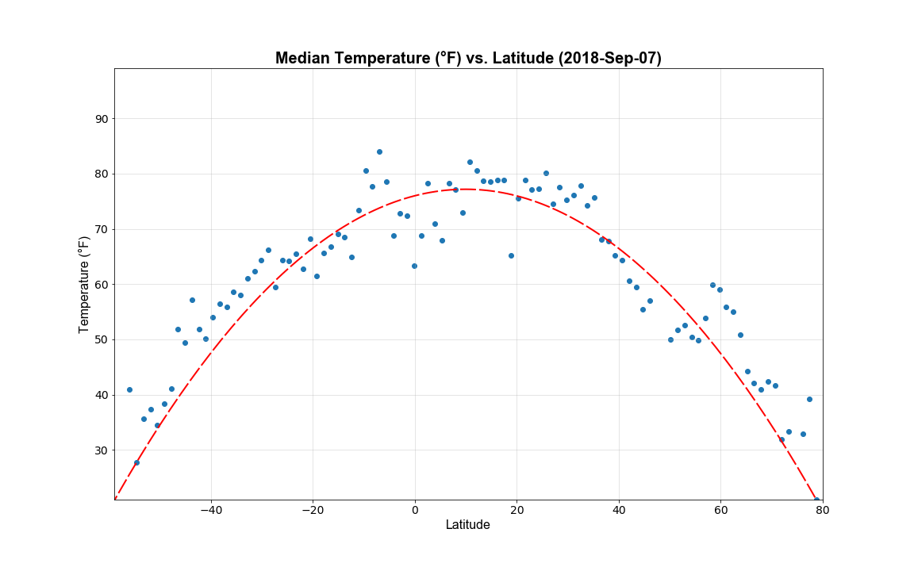

# PyWeather

## What is this about?

Based on the multiple weather observations my goal is to prove that the temperature in generaly gets higher the closer we get to the equator. Also I'm going to try to uncover other trends related to weather-related metrics

## What is Inside
  
- A Jupyter Notebook [PyWeather.ipynb](Code/PyWeather.ipynb) that contains Python code, all the necessary data breakdowns and some trends uncovered

- A markdown file [PyWeather.md](Output/PyWeather.md) that contains just data breakdowns and analysis
  
- The charts built from the randomly picked observations in the [Charts](Output/Charts) folder

  - **Cities Distribution along the Latitude**

    
  
  - **Temperature vs Latitude**
    
    

  - **Humidity vs Latitude**
    
    

  - **Cloudiness vs Latitude**
    
    

  - **Wind Speed vs Latitude**

    