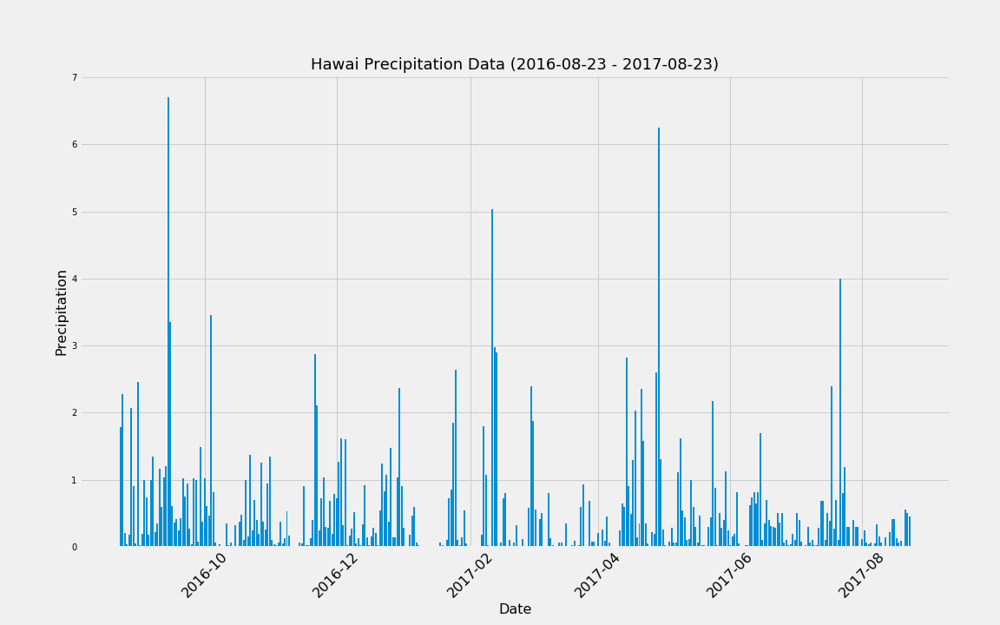
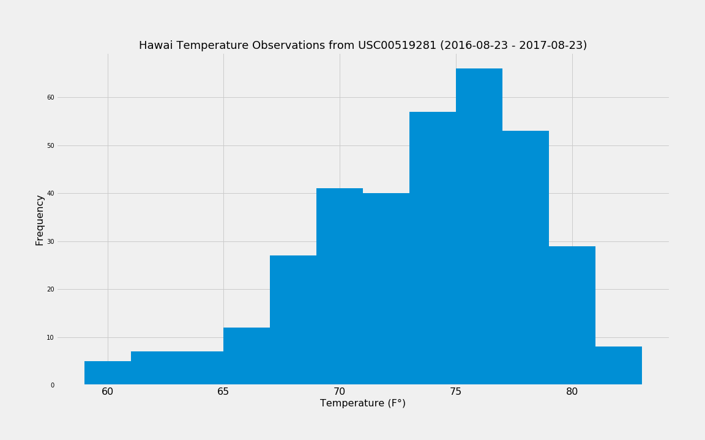
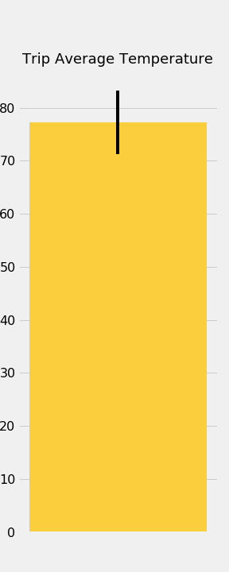

# SQL Alchemy

## What is this about?

This time I perform Hawai climate analysis using Python's ORM `SQLAlchemy` for querying the database, `pandas` library for data analysis, `matplotlib` for plotting and `FLASK` to build a RESTful service,

## What is Inside
  
- Jupyter notebook [climate_analysis.ipynb](climate_analysis.ipynb) that contains analysis and charts
  
- SQLite database file [hawaii.sqlite](hawaii.sqlite)

- Some charts saved as images

  - ### Hawai Precipitation Data

    

  - ### Hawai Temperature Observations

    

  - ### Trip Average Temperature

    

